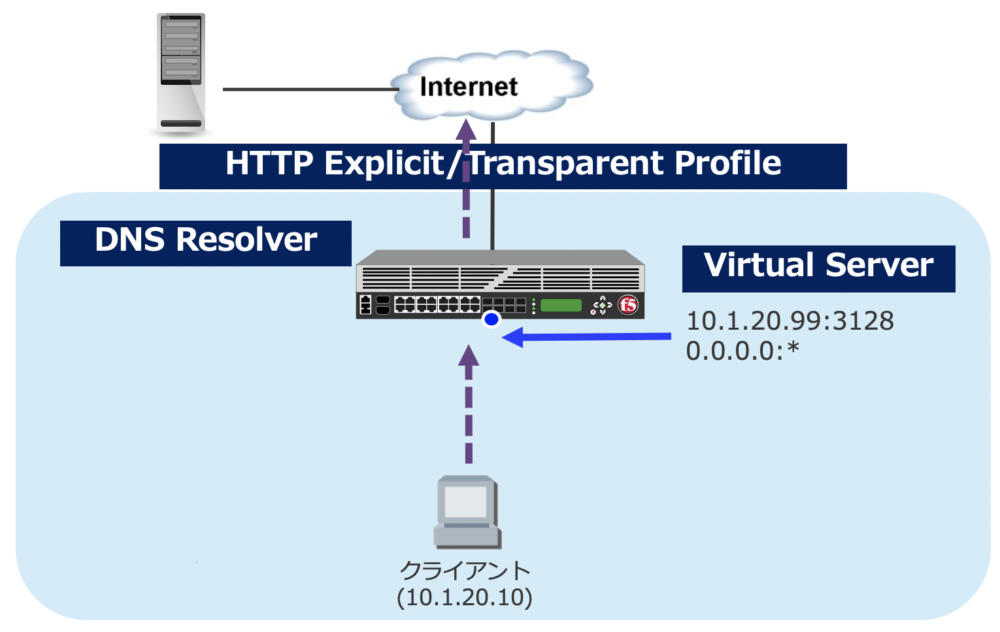

#. 関連するオブジェクト
===========================

本章では、BIG-IPをForward Proxyで利用する上で必要となる、オブジェクトの概要について紹介します。
詳細は、下図をご参照ください。

- HTTP Explicit Profile
  

  BIG-IPをクライアントから見た明示 (Explicit) プロキシとして設定する場合に利用するプロファイルです。
- HTTP Transparent Profile

  BIG-IPをクライアントから見た透過 (Transparent) プロキシとして設定する場合に利用するプロファイルです。
- DNS Resolver

  Forward Proxyとして動作するBIG-IPがクエリを行う、DNSサーバのアドレスを指定します。
- Virtual Server  
  
   
  クライアントから見た、プロキシサーバのIPアドレスになります。