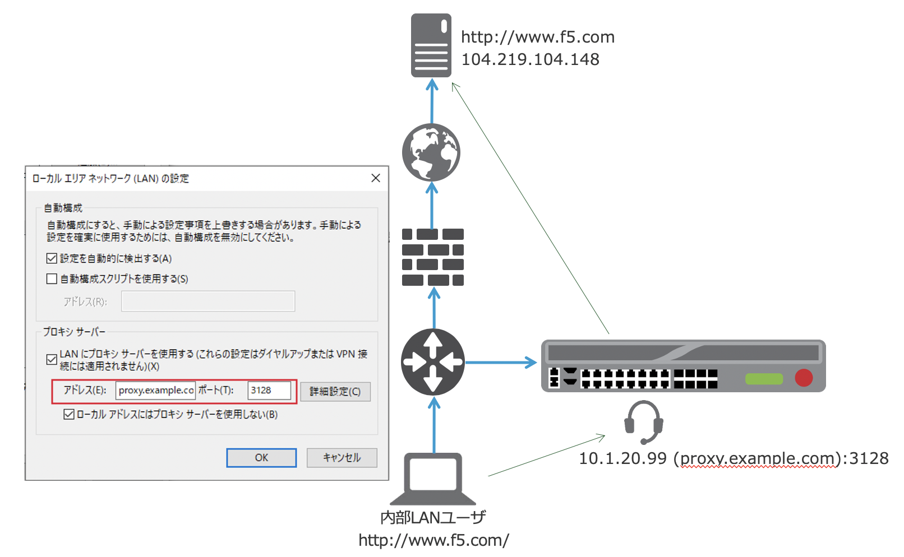
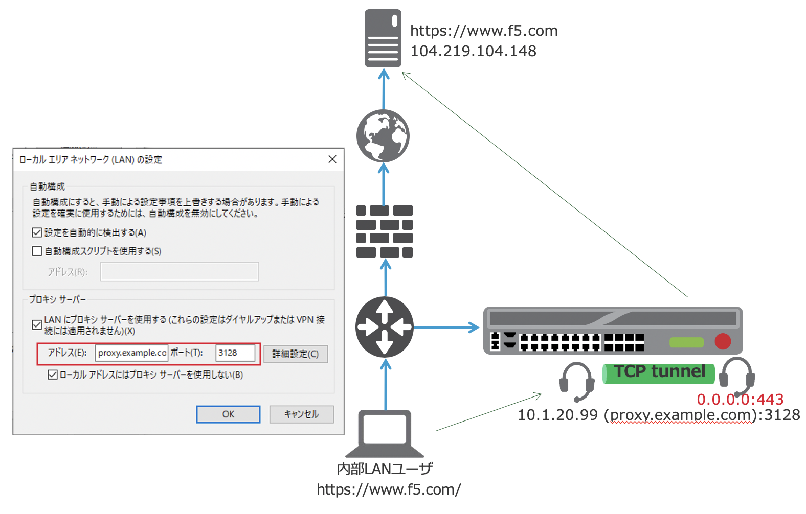

4. Explicit Forward Proxy トポロジー
===========================

BIG-IPを明示 (Explicit)プロキシとして使用するの場合のトポロジーは、下図の通りです。

- クライアントソフトウェア (ブラウザ)では、リクエストを直接プロキシサーバ (=BIG-IP)に転送するように設定します。
BIG-IPにおいて、プロキシサーバとして動作するVirtual Serverを設定します。
また、BIG-IP (プロキシサーバ)はホストの名前解決にDNSリゾルバを使用します。 (例: www.f5.com → 104.219.104.148)

- HTTPS Forward Proxyの場合は、HTTPにおける設定に加えて、TCPトンネル用のVirtual Serverの設定も必要となります。
