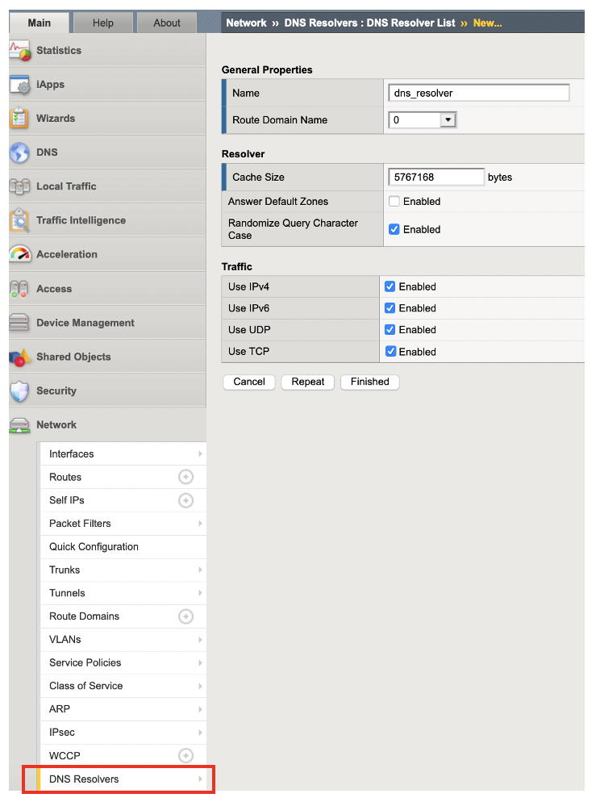
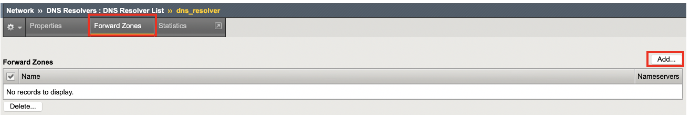
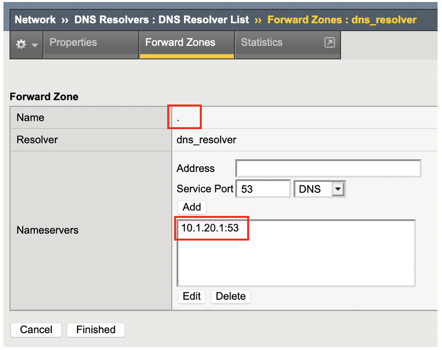

DNSリゾルバの設定
===========================

BIG-IPのConfiguration Utilityで、DNSリゾルバを設定します。

Network >> DNS Resolverを選択して、DNSリゾルバを作成します。下図の例では"dns_resolover"という名前のDNSリゾルバを作成しています。

作成したDNSリゾルバにおいて、Forward Zoneを選択します。

Forward　Zoneの名前を". (ドット)"と指定して、BIG-IPがクライアントとして名前解決を行うDNSサーバのアドレスを入力します。
